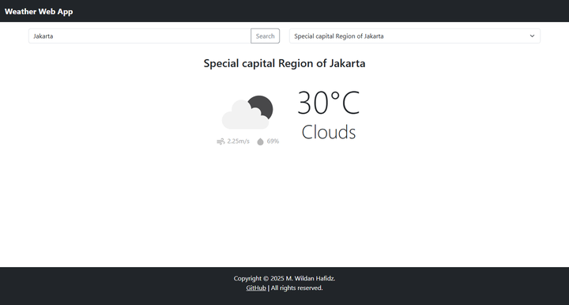
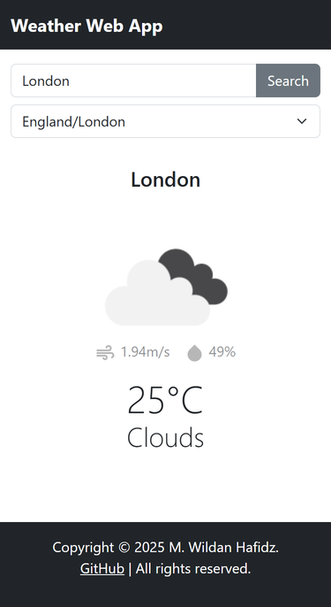

# Weather Web App 🌤️

A simple weather web application built using **HTML**, **CSS**, **JavaScript**, **Bootstrap**, and the **OpenWeatherMap API**.  
It shows current weather data for any city you search, including temperature, weather description, and icon.

## 🔧 Features

- Search weather by city name
- Display:
  - Temperature
  - Weather description
  - Weather icon
  - Humidity and wind speed
- Responsive layout using Bootstrap 5

## 🛠️ Tech Stack

- HTML
- CSS
- JavaScript
- [Bootstrap 5](https://getbootstrap.com/)
- [OpenWeatherMap API](https://openweathermap.org/api)

## 📸 Screenshots

### Desktop View

### Mobile View

